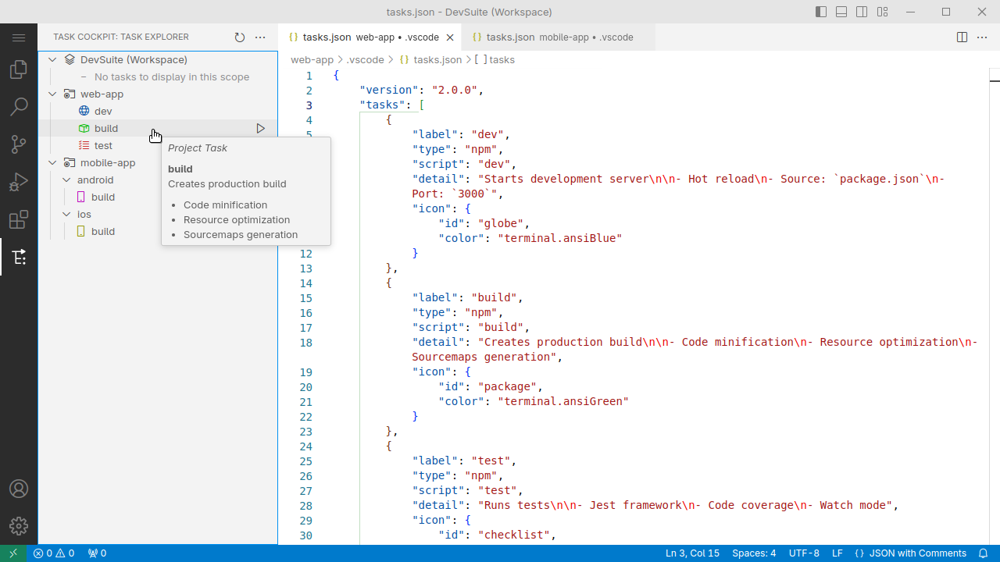
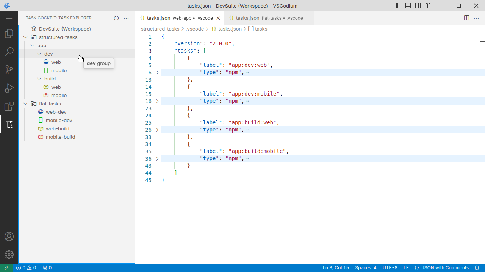
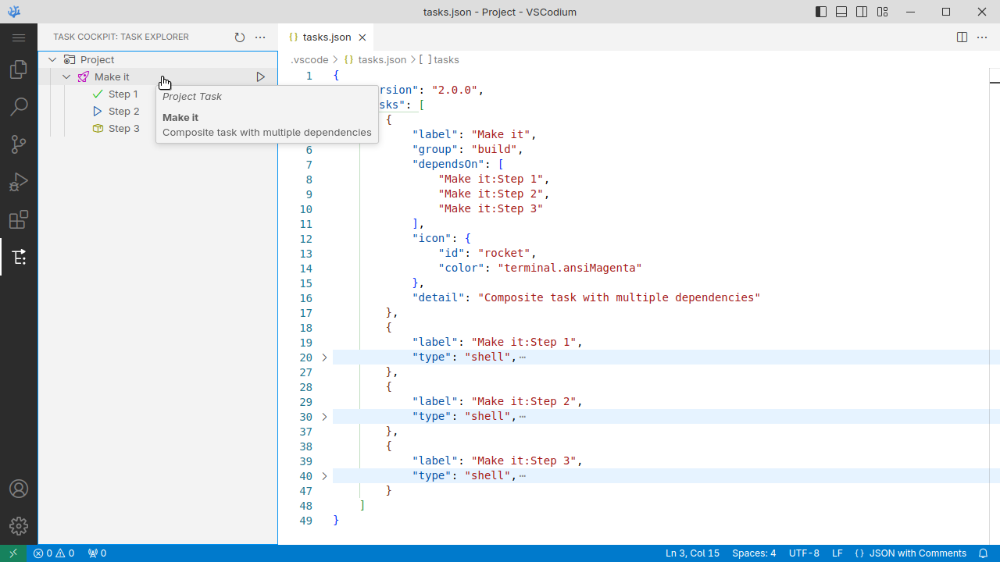
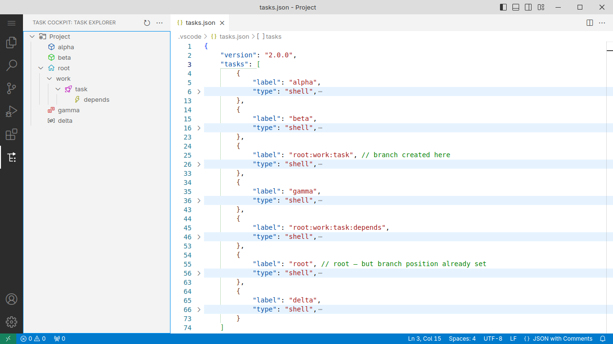
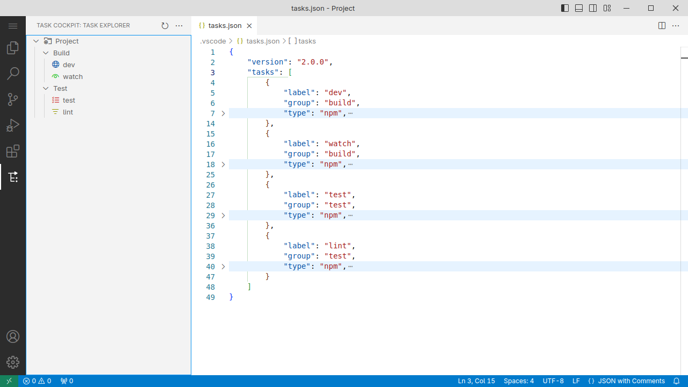
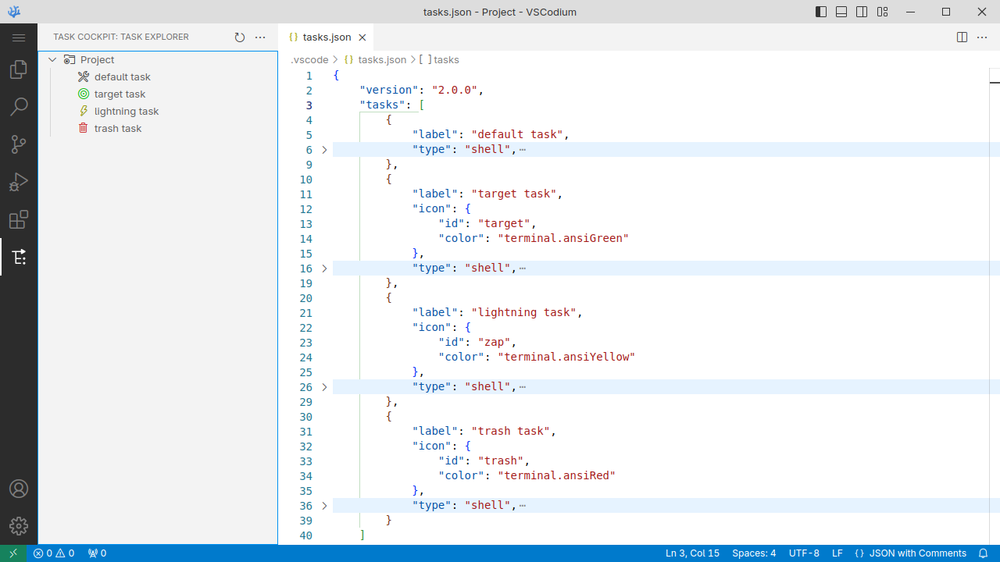
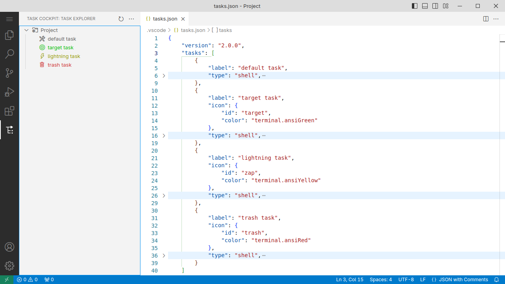
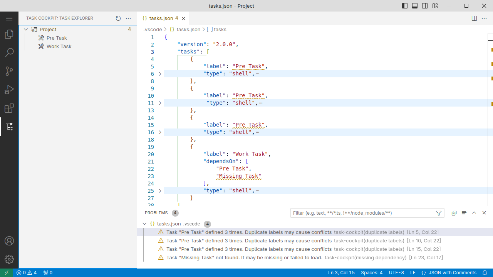

# Task Cockpit

Tree view panel for browsing and running tasks. Displays tasks from workspace and task files in an organized, customizable tree structure.

**This extension is useful if:**

- You integrate custom scripts/tools and want quick access to run and manage them
- You want to customize the task list for your specific workflow
- You have many tasks and need structure to navigate them
- You maintain a large task file and edit it manually

**This extension won't help much if:**

- You only use auto-detected tasks as-is — their providers likely offer dedicated panels already
- You don't have a `tasks.json` file and don't plan to create one
- You prefer keyboard-driven workflow over panel-based UI

## Features

**Organization**
- Tasks grouped by workspace folder
- Optional tree hierarchy by splitting labels into path segments, and/or grouping by `group` property
- Order matches task file — reorder tasks in file to reorder in tree

**Filtering**
- Option to exclude:
    - Specific workspace folders
    - Workspace-scope tasks
    - Individual tasks via `hide` field

**Display**
- Respects task `icon` definition (id, color)
- `detail` rendered as markdown on hover
- Visual status indicators (badge) for running tasks

**Actions**
- Open or create task file in editor
- Run, abort, access task terminal from context menu
- Jump to task definition in source file

**Validation**
- Duplicate labels and missing dependencies reported as problems

## Behavior

- Only tasks with explicit `label` property appear. Provider-detected tasks without an explicit label property are not shown:

  ~~~jsonc
  {
    "tasks": [
      {
        "label": "Make it", // User-defined task
        "type": "shell",
        ...
      },
      {
        "label": "npm: install", // Provider task with verbatim name
        "type": "npm",
        "script": "install",
        ...
      },
      {
        "label": "dev", // Renamed provider task
        "type": "npm",
        "script": "watch",
        ...
      },
      {
        "type": "npm", // Provider task WITHOUT a label
        "script": "test",
        "group": "test",
        ...
      }
    ]
  }
  ~~~

  Result: only tasks with labels appear. The unlabeled `npm: test` task is not shown.

- Global tasks (user-level `tasks.json`) are not shown — currently limited to workspace tasks.

## Known Issues

**Composite task status:** A task's running status badge only appears while its own command is executing — not during the `dependsOn` phase. For purely composite tasks (no command), this means no status badge will appear at all. Dependencies show their own status normally.

**Workspace-level task validation:** Validation does not yet cover tasks defined in `.code-workspace` files.

## Installation

**VS Code Marketplace:** Search for `@id:lumen-dev.task-cockpit` in Extensions View.

**Open VSX:** [open-vsx.org/extension/lumen-dev/task-cockpit](https://open-vsx.org/extension/lumen-dev/task-cockpit).

**Manual (VSIX):** Download from [GitHub Releases](https://github.com/LumenGNU/task-cockpit/releases).

## Usage

1. Open the **Task Cockpit** panel in the Activity Bar
1. Your tasks appear in the tree
1. Hover a task to reveal the **Run Task** button; right-click for more options
1. Access workspace settings via **More Actions** (**⋯**) in the panel header

> [!TIP]
> Drag the panel closer to the terminal area if that suits your workflow better.

> [!TIP]
> Set up keyboard shortcuts for frequently used actions — see [Custom Shortcuts](#custom-shortcuts).

## Configuration

All settings are available under `taskCockpit.*` in VS Code settings.

**Display** and **Filtering** settings are resource-scoped — in multi-root workspaces each folder can have its own configuration. Quick access to these settings is available via panel menu (**⋯**).

### Display

Configure visual appearance and hierarchy structure in the task explorer.

#### `segmentSeparator`

Character for splitting task labels into hierarchical segments.

> See also [`taskCockpit.display.useGroupKind`](#usegroupkind) — grouping by `group` field, without renaming tasks.

Must be a single non-alphanumeric, non-whitespace character or empty to disable hierarchy (default: empty).

For example, `:` organizes `build:dev:watch` into a tree: `build` → `dev` → `watch`.

> [!IMPORTANT]
> This setting only affects the tree display — tasks are still identified by their full label ("build:dev:watch", not "watch").

**Intermediate nodes** are implicit. Mentioning `build:dev:watch` creates the full path — no need to define `build` or `build:dev` as separate tasks. They become group nodes automatically.

A task doesn't have to be a **leaf node** — it can contain child tasks. Useful, for example, for visually grouping dependencies of a compound task:

**Hierarchy** comes from segments only. The order of tasks in the file doesn't affect nesting — `a:b` and `a:b:c` always produce `a` → `b` → `c`, regardless of which appears first.

**Vertical position** comes from the file. A branch appears at the position of its earliest occurrence. Tasks at the same level preserve their file order.

**Hidden tasks** (`"hide": true`) are removed from the tree.

> [!IMPORTANT]
> The separator is **ignored** at the start/end of labels, in consecutive occurrences, or when adjacent to whitespace. This allows using separator characters in natural contexts:
>
> - `Scripts:npm: install` with `:` separator: `Scripts` → `npm: install` (whitespace near `:`)
> - `Compile/make in out/` with `/` separator: `Compile` → `make in out/` (trailing slash ignored)

#### `useGroupKind`

Groups tasks by their `group` property.

Tasks with a `group` property are placed under a folder named after their group. For example, tasks with `group: "build"` or `group: { kind: "build" }` appear under a **Build** folder (the group name will be capitalized).

Works independently or combined with [`taskCockpit.display.segmentSeparator`](#segmentseparator).

> [!IMPORTANT]
> When combined, both grouping and splitting apply: a task named `Build:dev:watch` with `group: "build"` and separator `:` creates `Build` → `Build` → `dev` → `watch`, which is probably not what you intended.
>
> Remove the redundant prefix from the task label, or disable one of the settings to avoid duplicate nesting.

#### `useFolderIcon`

Show folder icons for intermediate tree nodes.

#### `defaultIconName`

Icon name for tasks without a custom icon in their definition. Defaults to `tools`.

[Available icons list](https://code.visualstudio.com/api/references/icons-in-labels#icon-listing).

> [!NOTE]
> Tasks support a custom `icon` property (id and color). Task Cockpit respects these definitions.

> [!TIP]
> To hide a task's icon, use `blank` as the icon name — it renders as an empty space.

#### `tintLabel`

Apply the task icon color to the task label text as well.

### Filtering

Control which tasks and workspace folders are visible in the task explorer.

#### `showHidden`

Show tasks marked with `hide: true`.

#### `excludeFolders`

Workspace folders to exclude from the task explorer.

Folders are matched by their display name — if a folder has a custom `name` in `.code-workspace`, use that name, not the directory name. (Has no effect in single-folder workspaces)

#### `excludeWorkspaceTasks`

Hide tasks defined at the workspace level. (Has no effect in single-folder workspaces)

### Validation

Enable diagnostics to detect potential issues with task definitions.

> [!NOTE]
> Validation runs when VS Code rebuilds the task list (e.g., after saving the task file or changing settings) — not in real time while editing.

#### `duplicateLabels`

Flag tasks with duplicate labels. Helps avoid [unexpected behavior](https://gist.github.com/LumenGNU/e8425e9e07309ce0e38d171bb6359675) when running tasks with identical names.

#### `dependencies`

*(Experimental)* Flag missing `dependsOn` references (default: false).

## Custom Shortcuts

The extension doesn't define default keybindings.

To add your own, open **Keyboard Shortcuts** (`Ctrl+K Ctrl+S`) and search for `Task Cockpit`. Or use this example as a starting point for your `keybindings.json`:

~~~jsonc
{ // Toggle panel visibility
  "key": "ctrl+shift+t",
  "command": "task-cockpit-view.toggleVisibility"
},
{ // Focus the panel
  "key": "ctrl+alt+t",
  "command": "task-cockpit-view.focus"
},
{ // Refresh task list
  "key": "ctrl+r",
  "command": "task-cockpit.view.refresh",
  "when": "focusedView == 'task-cockpit-view'"
},
{ // Run task (or start new instance if already running)
  "key": "ctrl+enter",
  "command": "task-cockpit.task.execute",
  "when": "focusedView == 'task-cockpit-view'"
},
{ // Stop all running instances of a task
  "key": "ctrl+shift+c",
  "command": "task-cockpit.task.abort-all",
  "when": "focusedView == 'task-cockpit-view'"
},
{ // Show terminal for running task
  "key": "ctrl+t",
  "command": "task-cockpit.task.show-terminal",
  "when": "focusedView == 'task-cockpit-view'"
},
{ // Jump to task definition in source file
  "key": "ctrl+e",
  "command": "task-cockpit.tasks-file.open-task",
  "when": "focusedView == 'task-cockpit-view'"
},
{ // Open tasks file for the selected item's scope
  "key": "ctrl+o",
  "command": "task-cockpit.tasks-file.open-file",
  "when": "focusedView == 'task-cockpit-view'"
}
~~~

The `focusedView` condition ensures shortcuts only work when the Task Cockpit panel has focus.

## License

MIT
