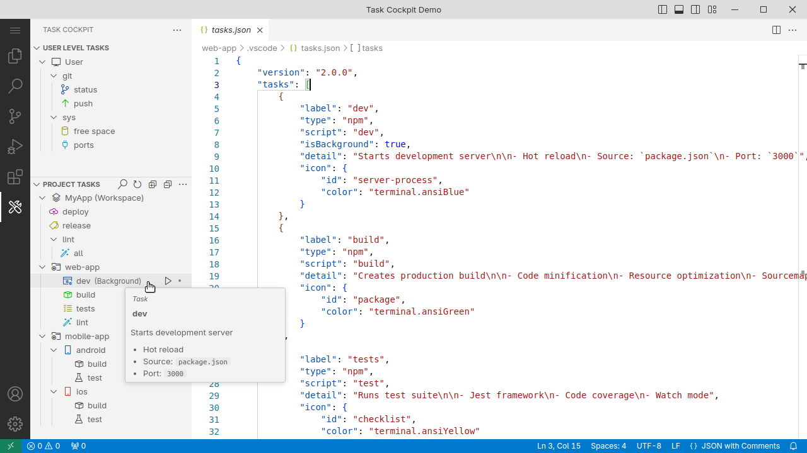
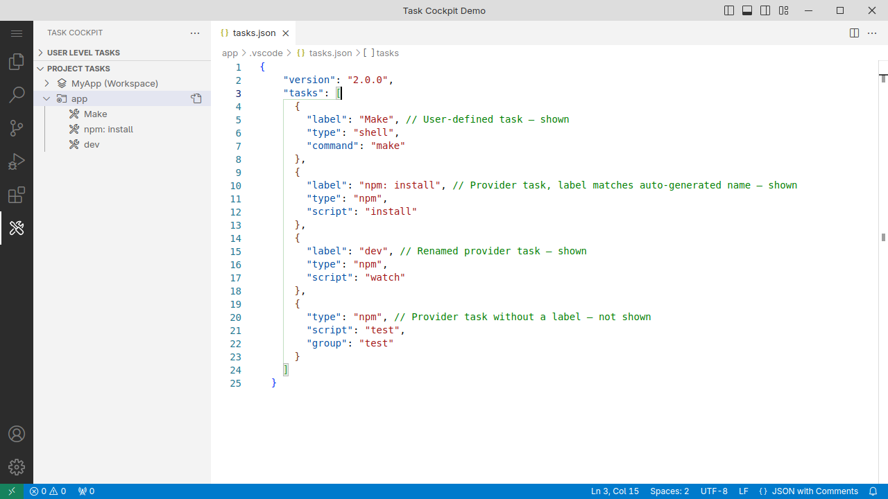
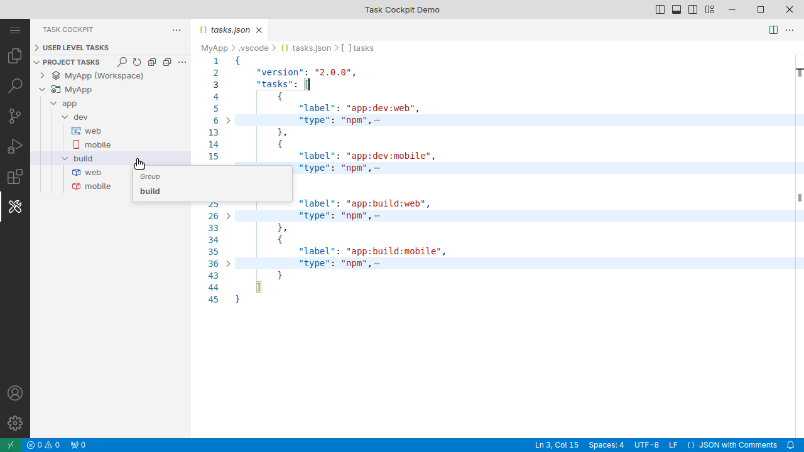
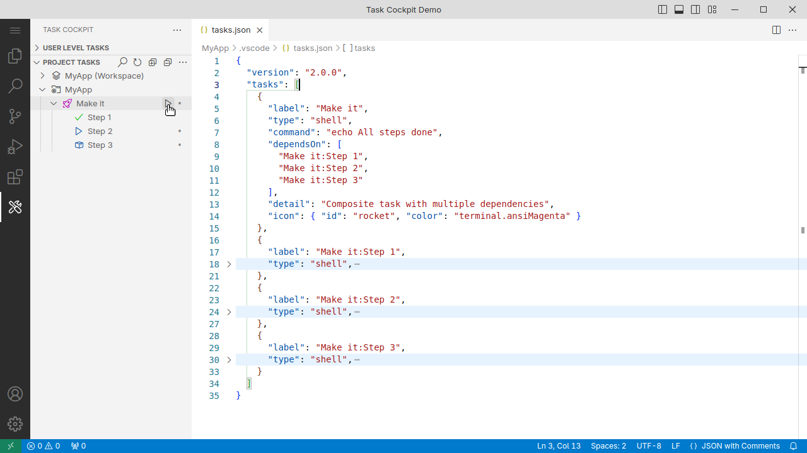
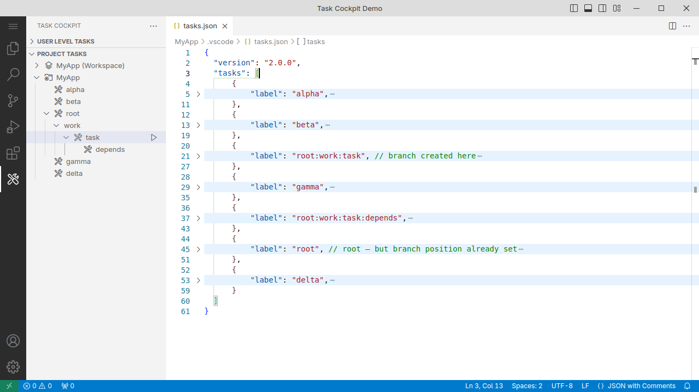
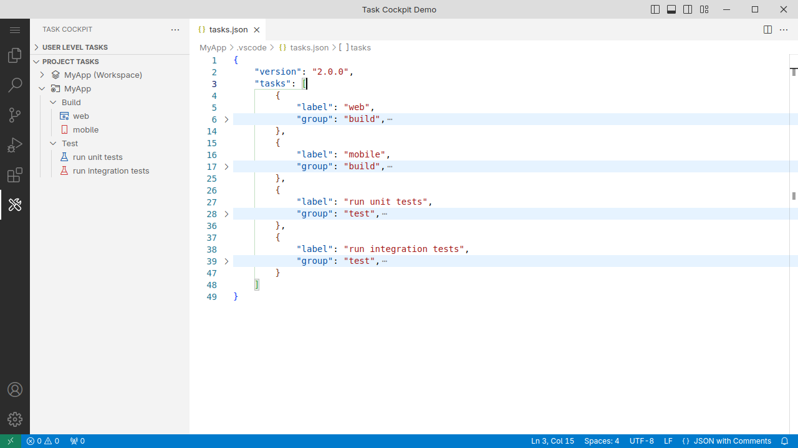
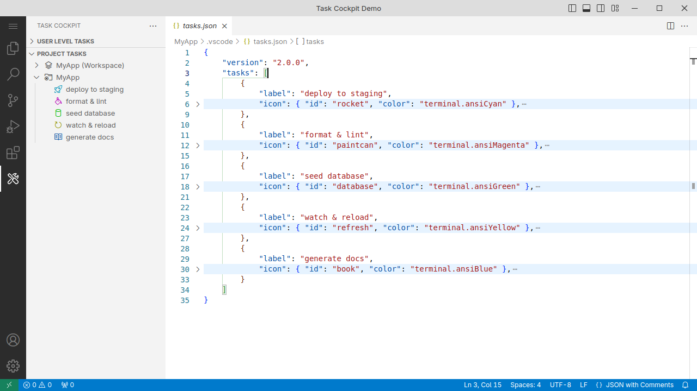
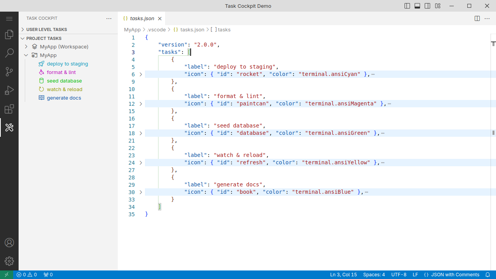
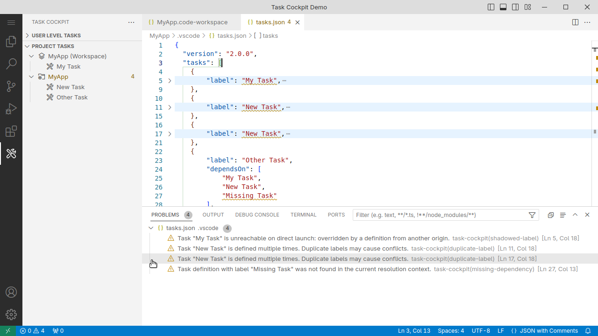

# Task Cockpit

A tree view for organizing, browsing, and running VS Code tasks from workspace and user profile.

**This extension is useful if:**

- You integrate custom scripts/tools and want quick access to run and manage them
- You want to customize the task list for your specific workflow
- You have many tasks and need structure to navigate them
- You maintain a large task file and edit it manually

**This extension won't help much if:**

- You only use auto-detected tasks as-is — their providers likely offer dedicated panels already
- You don't have a `tasks.json` file and don't plan to create one
- You prefer keyboard-driven workflow over panel-based UI

## Features

**Organization**
- Separate trees for user profile and workspace tasks
- Tasks grouped by workspace folder
- Configurable label splitting into path segments
- Optional grouping by VS Code `group` property
- Order in tree matches order in task file

**Filtering**
- Exclude specific workspace folders
- Hide individual tasks via VS Code `hide` field

**Display**
- Respects task `icon` definition (id, color)
- `detail` rendered as markdown on hover
- Visual status indicators for running tasks

**Actions**
- Run, abort, access task terminal
- Jump to task definition in file; open tasks file in editor

**Diagnostics**
- Flags tasks with identical labels that cannot all be reached
- Flags unresolvable `dependsOn` references

## Limitations

**Named tasks only:** Only tasks with a `label` appear in the tree. Auto-detected tasks
(e.g., npm scripts) are included only if explicitly given a label in a task file.

**Composite task status:** Running status is shown only while a task's own command is executing. Tasks that consist solely of dependsOn with no command of their own will not show a status decoration. Each dependency will still show its own running status while executing.

**User profile tasks:** The file URI for user profile tasks is not accessible to the extension. As a result, problems cannot be marked in the editor, and the context menu offers "Open User Tasks" instead of a task-level jump.

## Behavior

A task appears in the tree if and only if it has an explicit `label` property — regardless of whether it was user-defined or detected by a provider.

## Installation

**VS Code Marketplace:** Search for `@id:papio-dev.task-cockpit` in Extensions View.

**Open VSX:** [open-vsx.org/extension/papio-dev/task-cockpit](https://open-vsx.org/extension/papio-dev/task-cockpit).

**Manual (VSIX):** Download from [GitHub Releases](https://github.com/papio-dev/task-cockpit/releases).

## Usage

1. Open the **Task Cockpit** panel in the Activity Bar
1. Tasks are organized into user profile and workspace trees
1. Hover a task to reveal the **Run Task** button; right-click for more options
1. Access settings via **More Actions** (**⋯**) in the panel header

> [!TIP]
> Drag the panel closer to the terminal area if that suits your workflow better.

> [!TIP]
> Set up keyboard shortcuts for frequently used actions — see [Custom Shortcuts](#custom-shortcuts).

## Configuration

All settings are available under `taskCockpit.*` in VS Code settings.

**Display** and **Filtering** settings are resource-scoped and can be set at user, workspace, or folder level. A setting applied at user level affects all projects unless overridden at workspace or folder level.

Quick access to these settings is available via panel menu (**⋯**).

### Display

Configure visual appearance and hierarchy structure in the task explorer.

#### `display.segmentSeparator`

Character for splitting task labels into hierarchical segments.

> See also [`display.groupByTaskGroup`](#displaygroupbytaskgroup) — grouping by `group` field, without renaming tasks.

Must be a single non-alphanumeric, non-whitespace character. Leave empty to disable hierarchy (default).

For example, `:` organizes `app:build:web` into a tree: `app` → `build` → `web`.

> [!IMPORTANT]
> The separator is **ignored** at the start/end of labels, in consecutive occurrences, or when adjacent to whitespace. This allows using separator characters in natural contexts:
>
> - `Scripts:npm: install` with `:` separator: `Scripts` → `npm: install` (whitespace near `:`)
> - `Compile/make in out/` with `/` separator: `Compile` → `make in out/` (trailing slash ignored)

> [!NOTE]
> This setting only affects the tree display — tasks are still identified by their full label ("app:build:web", not "web").

**Intermediate nodes** are implicit. Mentioning `app:build:web` creates the full path — no need to define `app` or `build:web` as separate tasks. They become group nodes automatically.

A task doesn't have to be a **leaf node** — it can contain **child tasks**. Useful, for example, for visually grouping dependencies of a compound task:

**Hierarchy** comes from segments only. The order of tasks in the file doesn't affect nesting — `a:b` and `a:b:c` always produce `a` → `b` → `c`, regardless of which appears first.

**Vertical position** comes from the file. A branch appears at the position of its earliest occurrence. Tasks at the same level preserve their file order.

**Hidden tasks** (`"hide": true`) are removed from the tree. If a hidden task is part of
a path, its node remains as a non-runnable group.

#### `display.groupByTaskGroup`

Groups tasks by their `group` property.

Tasks with a `group` property are placed under a group node named after their group. For example, tasks with `group: "build"` or `group: { kind: "build" }` appear under a **Build** group node (the group name will be capitalized).

Works independently or combined with [`display.segmentSeparator`](#displaysegmentseparator).

> [!IMPORTANT]
> When combined, both grouping and splitting apply: a task named `Build:dev:watch` with `group: "build"` and separator `:` creates `Build` → `Build` → `dev` → `watch`, which is probably not what you intended.
>
> Remove the redundant prefix from the task label, or disable one of the settings to avoid duplicate nesting.

#### `display.useFolderIcon`

Show folder icons for intermediate tree nodes (non-runnable group nodes).

#### `display.defaultIconName`

Icon name for tasks without a custom icon in their definition. Defaults to `tools`.

[Available icons list](https://code.visualstudio.com/api/references/icons-in-labels#icon-listing).

> [!NOTE]
> Tasks support a custom `icon` property (id and color). Task Cockpit respects these definitions.

> [!TIP]
> To hide a task's icon, use `blank` as the icon name — it renders as an empty space.

#### `display.tintLabel`

Apply the task icon color to the task label text as well.

### Filtering

Control which tasks and workspace folders are visible in the task explorer.

#### `filtering.showUserLevelTasks`

Show or hide the user profile task tree. When disabled, the user profile panel is not shown at all.

> [!IMPORTANT]
> VS Code normally prevents hiding the last visible view in a panel through the right-click menu. This setting bypasses that — if workspace tasks are already hidden, disabling user profile tasks here will result in an empty panel.
>
> **To restore**: right-click the panel and check "Project Tasks".

#### `filtering.showHidden`

Show tasks marked with `hide: true`.

#### `filtering.excludeFolders`

Exclude workspace folders from the "Project Tasks" tree.

Matches folder display names as shown by VS Code — if a folder has a custom `name` in
`.code-workspace`, use that name, not the directory name. The **workspace scope** can be
excluded the same way, using its name as it appears in VS Code (e.g. `"something (Workspace)"`).

Example: `["my-project (Workspace)", "tests", "docs"]`

### Diagnostics

Enable diagnostics to surface potential issues with task definitions.

Task Cockpit filters out tasks that VS Code would silently override anyway — tasks whose label is shadowed by a higher-priority source, or duplicated within the same file in a way that makes the definition unreachable.

This filtering reflects how VS Code actually resolves tasks at runtime. When multiple sources (User settings, Workspace, project folders) define tasks with the same label, VS Code ignores your picker selection and re-resolves which version to run. Showing a task that would never actually execute is misleading, so task-cockpit omits it.

Diagnostics makes this visible — based on empirically documented VS Code task resolution behavior, the same rules that determine which task actually runs when you launch one from the Command Palette. Instead of a task silently disappearing from the list, you get a warning inline in the JSON file — at the exact line that causes the conflict.

The same applies to `dependsOn`: if a dependency cannot be resolved in the context where the parent task is defined, task-cockpit surfaces a warning rather than leaving you to discover it from a cryptic `Couldn't resolve dependent task` error at runtime.

> [!NOTE]
> Diagnostics run when VS Code rebuilds the task list (e.g., after saving the task file or changing settings) — not in real time while editing.

> [!NOTE]
> User-level tasks are factored into conflict detection, but no inline diagnostics are attached to `User/profiles/.../tasks.json` — the path to the active profile's file is not accessible via the VS Code API.

#### `diagnostics.shadowedTasks`

When enabled, flags task definitions that share the same label but cannot all be reached — either because a higher-priority origin shadows them, or because multiple definitions within the same origin conflict with each other.

Helps avoid [unexpected behavior](https://gist.github.com/LumenGNU/e8425e9e07309ce0e38d171bb6359675)
when running tasks with identical names.

#### `diagnostics.unreachableDependencies`

When enabled, flags tasks whose `dependsOn` references cannot be resolved — either because the target task does not exist, or because it is not reachable from the current resolution scope.

## Custom Shortcuts

The extension doesn't define default keybindings.

Use [this example](media/shortcuts.md) as a starting point for your `keybindings.json`.

## Tip this project

If you find Task Cockpit useful:

- **Rate it** on the [VS Code Marketplace](https://marketplace.visualstudio.com/items?itemName=papio-dev.task-cockpit) or [Open VSX](https://open-vsx.org/extension/papio-dev/task-cockpit)
- **Report issues** and **share ideas** on [GitHub Issues](https://github.com/papio-dev/task-cockpit/issues)
- [**Support financially** — currently more helpful than usual](https://ko-fi.com/papio_dev)

## License

MIT
